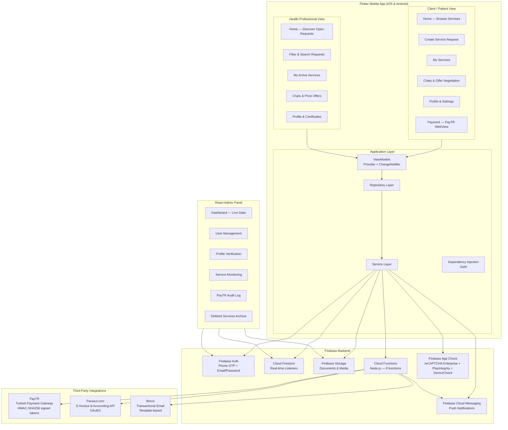
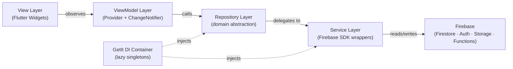
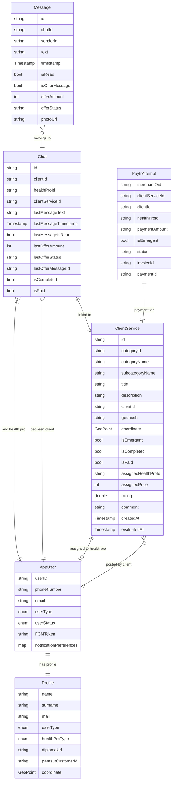
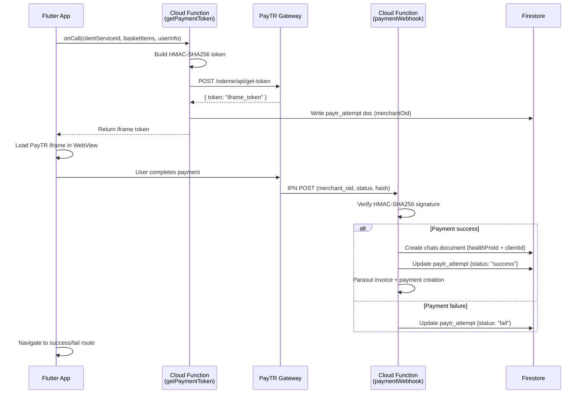
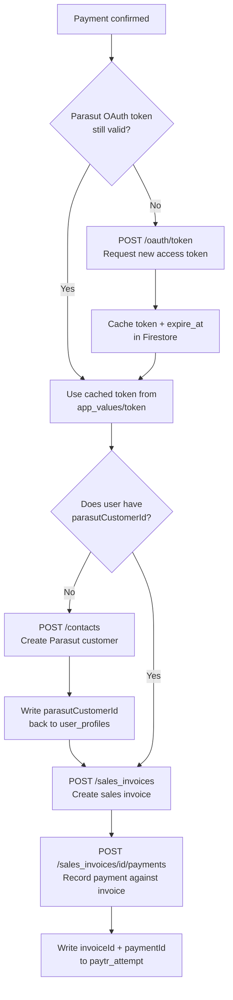
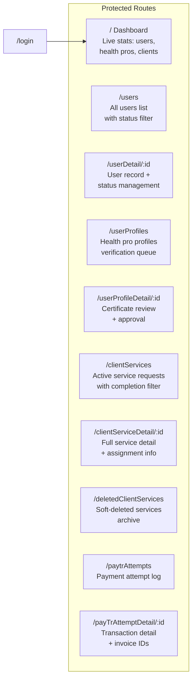
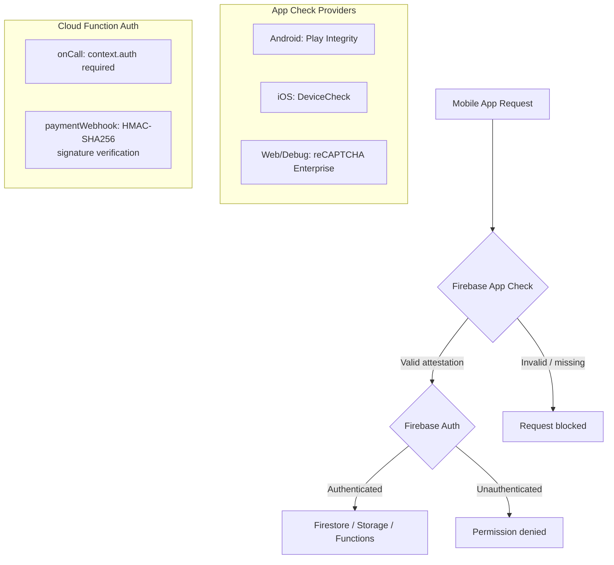

# Sağlık Evimde — On-Demand Home Health Services Platform

> A full-stack, production-grade home healthcare marketplace connecting patients with certified health professionals — built on Flutter 3 (iOS & Android), Firebase Cloud Functions (Node.js), and a React admin panel. Features real-time chat with in-chat offer negotiation, geohash-based service discovery, integrated payment processing with automated invoicing, and multi-role access control across three distinct surfaces.

---

## Table of Contents

- [Product Overview](#product-overview)
- [System Architecture](#system-architecture)
- [Repository Structure](#repository-structure)
- [Mobile Application](#mobile-application)
  - [Architecture Pattern](#architecture-pattern)
  - [Tech Stack](#tech-stack)
  - [Core Features](#core-features)
  - [Data Models](#data-models)
  - [Firestore Collections](#firestore-collections)
- [Backend — Cloud Functions](#backend--cloud-functions)
  - [Function Inventory](#function-inventory)
  - [Payment Pipeline](#payment-pipeline)
  - [Automated Invoicing](#automated-invoicing)
- [Admin Panel](#admin-panel)
  - [Tech Stack](#admin-tech-stack)
  - [Module Overview](#module-overview)
- [Security Architecture](#security-architecture)
- [Notification System](#notification-system)
- [Source Code](#source-code)

---

## Product Overview

Sağlık Evimde ("My Health at Home") is a two-sided healthcare marketplace for the Turkish market. Patients post service requests describing what care they need and where; certified health professionals browse open requests, initiate contact through a real-time chat system, submit price offers, and — once a patient accepts and completes payment — the service is confirmed and a chat channel is opened for coordination.

The platform supports both individual and corporate health professionals (with separate registration flows and data models), handles Turkish tax compliance via automated Parasut.com invoice generation, and enforces API integrity through Firebase App Check with reCAPTCHA Enterprise.

---

## System Architecture

---

## Repository Structure

| Repository | Language / Runtime | Role |
|---|---|---|
| `saglikevimde` | Dart / Flutter 3 + Node.js Cloud Functions | Patient & health professional mobile app + backend logic |
| `saglikevimde-panel` | JavaScript / React 18 | Admin management panel — deployed on Firebase Hosting |

---

## Mobile Application

### Architecture Pattern

The app follows a strict **MVVM** (Model–View–ViewModel) layered architecture:

- **ViewModels** (`ApplicationViewModel`, `UserViewModel`, `CategoryViewModel`, `ClientServiceViewModel`, `ChatViewModel`) extend `ChangeNotifier` and are registered at the app root via `MultiProvider`.
- **Repositories** (`UserRepository`, `ClientServiceRepository`, `ChatRepository`, `CategoryRepository`) own all business logic and data orchestration.
- **Services** (`FirebaseFirestoreService`, `FirebaseAuthenticationService`, `FirebaseStorageService`, `FirebaseFunctionsService`, `NotificationService`, `RecaptchaService`, `LocalStorageService`) are thin wrappers around Firebase SDKs.
- **Dependency Injection** via `GetIt` — all services and repositories registered as lazy singletons in `setupLocator()`.

### Tech Stack

| Concern | Package | Version |
|---|---|---|
| State management | `provider` | ^6.1.2 |
| Dependency injection | `get_it` | ^9.2.0 |
| Firebase core | `firebase_core` | ^4.4.0 |
| Authentication | `firebase_auth` | ^6.1.4 |
| Database | `cloud_firestore` | ^6.1.2 |
| File storage | `firebase_storage` | ^13.0.6 |
| Serverless backend | `cloud_functions` | ^6.0.6 |
| Push notifications | `firebase_messaging` + `flutter_local_notifications` | ^16.1.1 / ^18.0.1 |
| API security | `firebase_app_check` + `recaptcha_enterprise_flutter` | ^0.4.1 / ^18.5.1 |
| PDF viewer | `syncfusion_flutter_pdfviewer` | ^32.2.3 |
| In-app browser | `webview_flutter` | ^4.10.0 |
| Image handling | `image_picker` + `image_cropper` | ^1.1.2 / ^11.0.0 |
| Document upload | `file_picker` | ^10.3.10 |
| Animations | `lottie` | ^3.1.2 |
| Ratings UI | `flutter_rating_bar` | ^4.0.1 |
| Carousel | `carousel_slider` | ^5.0.0 |
| Searchable dropdowns | `dropdown_search` | ^5.0.6 |
| Localisation | `flutter_localization` | ^0.3.3 |
| Network image cache | `cached_network_image` | ^3.4.1 |
| Network awareness | `connectivity_plus` | ^7.0.0 |
| Turkish string utils | `turkish` | ^0.2.1 |
| Local persistence | `shared_preferences` | ^2.2.3 |
| HTTP client | `http` | ^1.2.2 |

### Core Features

#### Client (Patient) Surface

- **Service Request Creation** — patients post detailed care requests with category, subcategory, free-text description, location (city / district / quarter), geohash coordinate, and optional price constraints. Requests include an `isEmergent` flag for urgent cases with different pricing tiers.
- **Service Discovery Feed** — real-time feed of open requests with multi-dimensional filtering (`FilterDto`) and ordering (`OrderByDto`) composable at the repository layer.
- **In-app Chat with Offer Negotiation** — real-time Firestore-backed messaging with a dedicated offer lifecycle: `pending → accepted / rejected / canceled`. Both parties see offer state rendered as distinct widget types (`incoming_offer_message_widget`, `outgoing_offer_message_widget`, and their accepted/rejected/canceled variants).
- **Photo Messaging** — image messages stored in Firebase Storage, rendered inline in the chat timeline.
- **PayTR Payment Integration** — payment triggered via Cloud Function (`getPaymentToken`), iframe loaded in a `WebView`, with success/fail deep-link callbacks routing back into the app's named route system.
- **Medical Document Library** — PDF prescriptions and service reports viewable in-app via Syncfusion PDF viewer.
- **Rating & Review** — post-service evaluation with star rating and free-text comment, persisted back to the service document.
- **Blocked Users** — both roles can block counterparties; blocked state enforced at the UI level.
- **Notification Preferences** — granular per-category push notification opt-out stored in Firestore under `notificationPreferences`.

#### Health Professional Surface

- **Request Discovery** — health pros browse open `client_services` filtered by category, location, price range, and urgency, via a dedicated filter page with a custom `CustomSearchBar` widget.
- **Offer Submission** — health pros send price offers inside the chat thread; offer amount and status tracked on the `Message` document itself and denormalized to the parent `Chat` document (`lastOfferAmount`, `lastOfferStatus`, `lastOfferMessageId`).
- **Profile & Certificate Management** — upload diploma, professional certificates (`Certificate` model), and profile photo to Firebase Storage; profile verification status managed by admin.
- **Individual vs Corporate Registration** — separate DTOs (`HealthProIndividualRegisterDto`, `HealthProCorporateRegisterDto`) with different required fields (TCKN vs VKN, tax office, official company name).
- **Earnings Dashboard** — `getHealthProStats` Cloud Function aggregates completed services and average rating server-side, avoiding expensive client-side collection scans.

### Data Models

### Firestore Collections

| Collection | Description |
|---|---|
| `users` | Auth-linked user records — user type, status, FCM token, notification prefs |
| `user_profiles` | Public-facing profile data — name, photo, certificates, Parasut customer ID |
| `client_services` | Active service requests with geohash coordinates |
| `deleted_client_services` | Soft-delete archive (populated by Cloud Function trigger on document deletion) |
| `chats` | Chat channel documents with denormalized last-message and last-offer metadata |
| `chats/{id}/messages` | Subcollection — individual messages and offer records |
| `paytr_attempt` | PayTR transaction log — payment token, status, linked invoice/payment IDs |
| `app_values` | App-wide config — cached Parasut OAuth access token with expiry timestamp |

---

## Backend — Cloud Functions

All serverless logic runs on **Firebase Cloud Functions (Node.js)**. Functions are authenticated via Firebase Auth context or HMAC-SHA256 webhook signature verification.

### Function Inventory

| Function | Trigger | Description |
|---|---|---|
| `getPaymentToken` | `https.onCall` | Builds HMAC-SHA256 signed PayTR token, records `paytr_attempt` document, returns iframe token to client |
| `paymentWebhook` | `https.onRequest` | Receives PayTR IPN callback, verifies HMAC signature, creates Firestore chat channel on success, triggers Parasut invoice + payment creation |
| `updateLastMessage` | `firestore.onCreate` on `chats/{id}/messages/{id}` | Denormalizes last-message fields to parent chat document; dispatches targeted FCM push notification (respecting per-user notification preferences) |
| `moveDeletedDocument` | `firestore.onDelete` on `client_services/{id}` | Copies deleted service document to `deleted_client_services` archive collection |
| `sendWelcomeEmail` | `firestore.onCreate` on `user_profiles/{id}` | Sends role-appropriate Brevo transactional email (template ID 4) to newly registered health professionals |
| `deleteUnassignedClientServices` | `pubsub.schedule` every 24 hours | Batch-deletes unassigned service requests older than 15 days to keep the discovery feed current |
| `getHealthProStats` | `https.onCall` | Server-side aggregation of completed service count and average rating for a given health professional |
| `getClientStats` | `https.onCall` | Server-side count of completed services for a given patient |

### Payment Pipeline

Pricing is tier-based: standard service ₺30.00 / emergency service ₺42.00 (transmitted as integer cents: `3000` / `4200`).

### Automated Invoicing

On successful payment, the webhook integrates with the **Parasut.com accounting API** (Turkish e-invoice platform) via OAuth2:

Token refresh is handled transparently inside `apiRequestWithToken()` — on a 401 response the function fetches a new token, updates the Firestore cache, and retries automatically.

---

## Admin Panel

### Admin Tech Stack

The admin panel is a React 18 single-page application bootstrapped with Create React App and deployed on Firebase Hosting. It reads and writes directly to Firestore and Firebase Storage — no additional API layer. Authentication is handled via Firebase Auth with a React `AuthContext`; all routes except `/login` are wrapped in an `AuthGuard` component that redirects unauthenticated sessions.

### Module Overview

**Dashboard** — live aggregate stats from Firestore: total user count, health professional count split by individual / corporate, and patient count, rendered as Ant Design `Statistic` cards.

**User Management** — full user list with `userStatus` filtering (active, passive, deleted); individual records show auth data alongside profile data with the ability to update status directly.

**Profile Verification** — health professional profiles pending admin approval; reviewers inspect uploaded diploma and certificate documents via a `FileLink` component that resolves Firebase Storage URLs, then approve or reject profiles (sets `userStatus` from `passive` to `active`).

**Service Monitoring** — all service requests with a reusable `CompletionStatusFilter` component; detail view shows full assignment state including `assignedHealthProId`, `assignedPrice`, payment status, and post-service rating.

**Deleted Services Archive** — browsable archive of services removed from the live discovery feed, auto-populated by the `moveDeletedDocument` Cloud Function.

**PayTR Audit Log** — full transaction history with attempt status (`success` / `fail`), payment amounts, linked `clientServiceId`, and Parasut invoice / payment IDs for financial reconciliation.

---

## Security Architecture

- **Firebase App Check** is activated at app boot with platform-specific providers (Play Integrity on Android, DeviceCheck on iOS, reCAPTCHA Enterprise on web/debug) via a dedicated `RecaptchaService` initialised before `runApp()`.
- All `onCall` Cloud Functions check `context.auth` and throw `HttpsError('unauthenticated')` for unsigned calls.
- The `paymentWebhook` function verifies IPN authenticity using HMAC-SHA256 computed from `merchant_oid + merchantSalt + status + total_amount` against the posted `hash` — ensuring only genuine PayTR callbacks trigger business logic.
- Health professional accounts start with `userStatus: passive` and require explicit admin approval before gaining full platform access.

---

## Notification System

Push notifications are dispatched entirely server-side by the `updateLastMessage` Cloud Function:

1. A new message document is created in `chats/{chatId}/messages/{messageId}`.
2. The function reads the parent chat to identify the recipient and fetches their `FCMToken` and `notificationPreferences` from the `users` collection.
3. If `notificationPreferences.messageNotifications !== false`, it looks up the sender's display name from `user_profiles` and calls `admin.messaging().send()` with the `chatId` in the data payload for in-app routing.
4. The mobile app handles both foreground (via `flutter_local_notifications`) and background message delivery natively through the `firebase_messaging` plugin.

---

## Source Code

Source code is proprietary and not publicly available — intellectual property of a previous employer. This repository documents architecture, technology choices, data models, and feature scope for portfolio purposes only.

---

*Built end-to-end as a full-stack project — mobile (Flutter / Dart), serverless backend (Node.js Cloud Functions), and admin web panel (React).*
